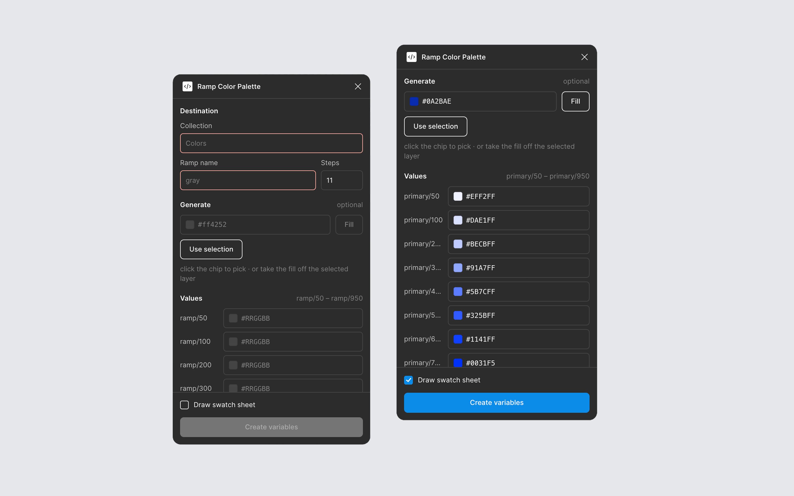
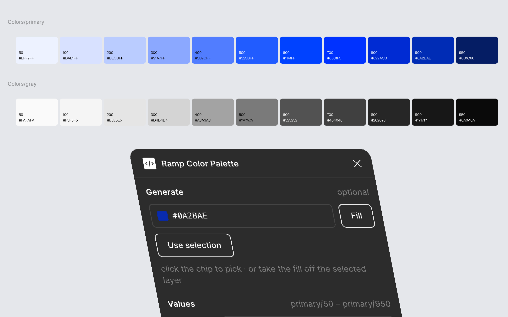

# Ramp Color Palette

A Figma plugin. Give it one color and it builds an 11-step ramp, creates a
COLOR variable per step, and optionally draws a documentation sheet whose
swatches stay bound to those variables.

> **Requires the Figma desktop app.** This is a development plugin, not a
> Community one, so it's installed by importing a manifest — something the
> browser version cannot do.

## Install

1. Download **[ramp-color-palette.zip](https://github.com/Aljhsrdnl/figma-ramp-color-palette/releases/latest/download/ramp-color-palette.zip)** and unzip it. You'll get a `ramp-color-palette` folder.
2. Open the Figma desktop app, in any design file you can edit.
3. **Plugins → Development → Import plugin from manifest…**
4. Select `manifest.json` inside that folder.

It now lives under **Plugins → Development → Ramp Color Palette**.

## Use

Enter a collection name, a ramp name (`gray`), and how many steps you want. Set
the base color however suits you — click the chip to pick one, hit
**Use selection** to take the fill off the selected layer, or type the hex —
then **Fill** to generate the rest. Or paste all the values yourself; generated
values are written *into* the fields, so every one stays hand-editable. Tick
**Draw swatch sheet** if you want the documentation card too, then **Create
variables**.

Steps are named from the standard ladder — `50, 100, 200 … 900, 950` — so you
get `gray/50` through `gray/950`, which Figma folds into a `gray` group in the
variables panel.

Re-running is safe. Variables are matched by name inside the collection and
updated in place, and a sheet you have already drawn is replaced where it
stands rather than stacked on top of.

## How the ramp is derived

Reverse-engineered from [UI Colors](https://uicolors.app)' output rather than
guessed at:

- **Hue is held constant** from your input.
- **Lightness** comes from whichever Tailwind v3 family sits nearest — those
  curves are the reference, not the palette.
- **Saturation** is the reference step's, scaled by how much more or less
  saturated your color is than the step it anchors to.
- **Your exact hex survives** at whichever step its lightness lands closest to,
  so the color you started from is still in the ramp.

Measured against UI Colors: **7 of 11 steps match exactly**, worst channel
delta **6/255** on the rest. Feeding it Tailwind's own `red-50` reproduces
Tailwind red exactly. Sweeping **15,600 inputs** across hue, saturation and
lightness produced no ramp that lost its descending order.

## Why the labels flip color where they do

Each chip's label is pure black or pure white, chosen by the swatch's WCAG
relative luminance with the threshold at **0.179**.

That number is derived, not eyeballed: it's where a color's contrast ratio
against black equals its ratio against white — 4.58:1 either way. The obvious
0.5 midpoint would put a mid-grey like `#A5A5A5` on white text at 2.5:1, when
black would have given it 8.5:1.

The labels aren't softened for the same reason. Dropping the dark label to
`#121212` takes the worst-case step from 4.69:1 to 4.12:1 — under the 4.5:1
floor, which still applies at the label's 14px, since WCAG only relaxes to
3:1 at 18.66px bold or 24px regular.

## Known limits

- Development plugin — no auto-update. Re-download to upgrade.
- Local variable collections only; library and remote collections aren't matched.
- One mode per collection. No light/dark pairs.
- The sheet is drawn in Mona Sans, falling back to Inter if you don't have it.
- A sheet is found again by its frame name (`<collection>/<ramp>`), because a
  hand-written manifest has no plugin id to key private data to. Rename the
  frame and the next run draws a fresh one instead of replacing it.

## License

MIT — see [LICENSE](LICENSE).
